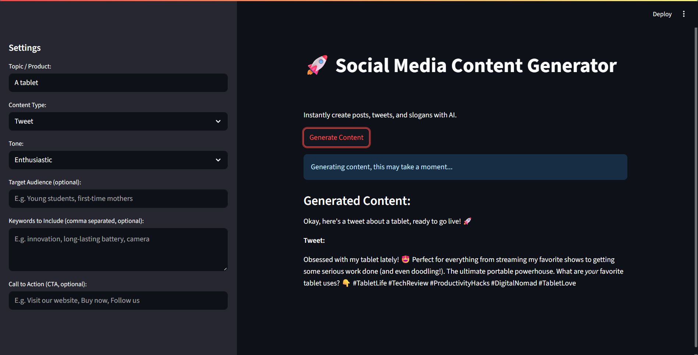

# AI Content Assistant



## Overview

AI Content Assistant is an interactive Streamlit application designed to help you quickly generate high-quality digital marketing and social media content using AI. With a simple and intuitive interface, you can create tweets, Instagram/Facebook posts, slogans, product descriptions, and short video script ideas tailored to your needs.

The app leverages Google's Gemini model via the OpenAI-compatible API, allowing for advanced prompt engineering and dynamic content customization.

## Features

- **Versatile Content Generation:** Instantly create tweets, Instagram/Facebook posts, slogans, product descriptions, and short video script ideas.
- **Advanced Customization:** Adjust topic, content type, tone (enthusiastic, informative, funny, persuasive, formal, inspirational), target audience, and keywords.
- **Customizable Call to Action (CTA):** Easily include a specific CTA in your generated content.
- **Hashtag Suggestions:** For social media content, the AI can suggest relevant hashtags.
- **User-Friendly Interface:** Built with Streamlit for a smooth and interactive experience.

## Technologies Used

- **Python**
- **Streamlit**
- **OpenAI Python SDK** (used to connect to Gemini API)
- **Google Gemini API** (via OpenAI-compatible endpoint)
- **Dotenv** (for environment variable management)

## Installation & Usage

1. **Clone the repository:**
    ```bash
    git clone https://github.com/alejo-rodd/ai_content_assistant.git
    cd ai_content_assistant
    ```

2. **Create a virtual environment (recommended):**
    ```bash
    python -m venv venv
    source venv/bin/activate  # On Linux/macOS
    venv\Scripts\activate     # On Windows
    ```

3. **Install dependencies:**
    ```bash
    pip install -r requirements.txt
    ```
    Make sure your `requirements.txt` includes: `streamlit`, `openai`, `python-dotenv`.

4. **Configure your Gemini API Key:**
    - Create a `.env` file in the project root and add:
      ```
      GEMINI_API_KEY="your_gemini_api_key_here"
      ```
    > **Note:** Even though the app uses the OpenAI Python SDK, you must use your Gemini API key and endpoint.

5. **Run the Streamlit application:**
    ```bash
    streamlit run app.py
    ```
    The app will open automatically in your browser.

## Contact

Feel free to connect if you have questions or want to discuss the project!

- **GitHub:** [alejo-rodd](https://github.com/alejo-rodd)
- **LinkedIn:** Alejandro Rodríguez Gómez